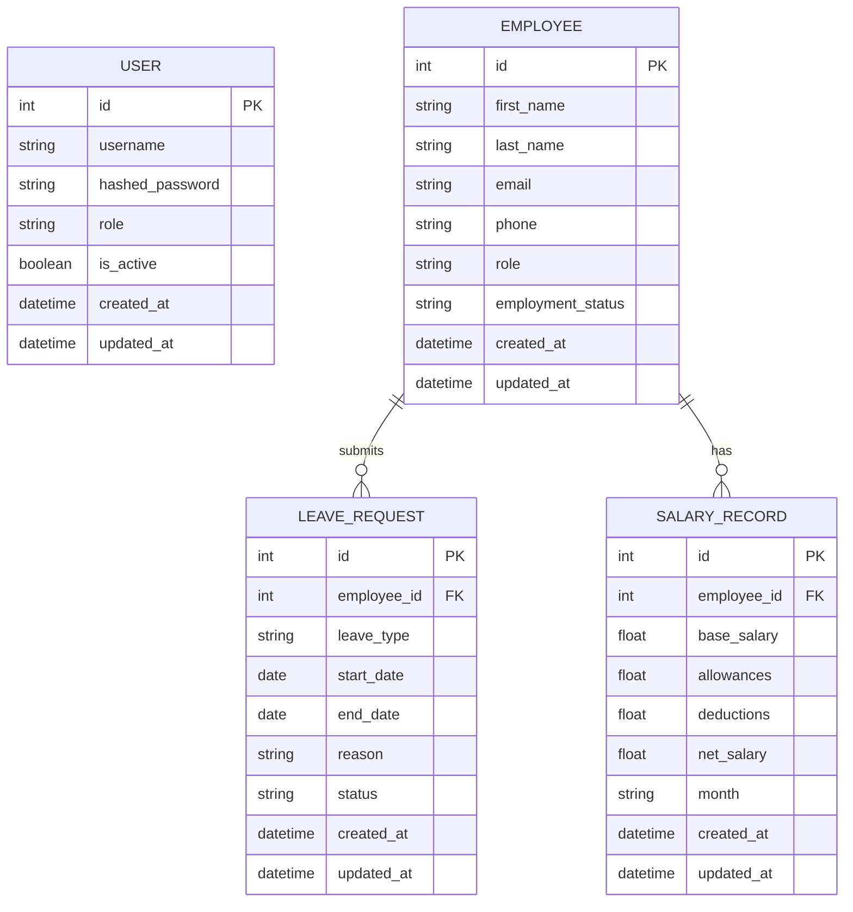

# PARCLE Memory: Employee Tracker SaaS

This file is long-term AI handoff memory for future maintenance agents.

## 1. System Graph

```text
employee-tracker/
├── backend/
│   ├── main.py                 FastAPI app factory, CORS, startup table creation, seed data, health/version routes.
│   ├── database.py             SQLAlchemy engine, Base, SessionLocal, get_db dependency.
│   ├── models.py               ORM entities: User, Employee, LeaveRequest, SalaryRecord.
│   ├── schemas.py              Pydantic v2 request/response schemas and validation.
│   ├── auth.py                 JWT creation/validation, bcrypt helpers, login route, current-user dependency.
│   ├── requirements.txt        Backend Python dependencies.
│   ├── .env.example            Environment variable template.
│   ├── Dockerfile              Python 3.12 backend container.
│   └── routers/
│       ├── __init__.py         Router package marker.
│       ├── employees.py        Employee CRUD and search endpoints.
│       ├── salary.py           Salary record CRUD and monthly payroll summary.
│       └── leaves.py           Leave request CRUD, status actions, and summary.
├── frontend/
│   ├── package.json            React/Vite dependencies and scripts.
│   ├── index.html              Vite HTML entry point.
│   ├── postcss.config.js       Tailwind/PostCSS configuration.
│   ├── tailwind.config.js      Design tokens and content scanning.
│   ├── vite.config.js          Vite React plugin and dev server configuration.
│   ├── Dockerfile              Node/Vite frontend container.
│   └── src/
│       ├── components/
│       │   ├── Navbar.jsx      Top bar, user display, sign out.
│       │   ├── Sidebar.jsx     App navigation and responsive drawer.
│       │   └── Card.jsx        Reusable metric card.
│       ├── views/
│       │   ├── SignIn.jsx      Login screen.
│       │   ├── Dashboard.jsx   Workforce metrics and salary creation/summary.
│       │   ├── EmployeeList.jsx Employee CRUD/search UI.
│       │   └── LeaveTracker.jsx Leave submission, status filtering, approvals.
│       ├── context/
│       │   └── AuthContext.js  Axios instance, token storage, auth provider, login/logout.
│       ├── App.jsx             Router and protected layout.
│       ├── index.css           Tailwind imports and global base styles.
│       └── main.jsx            React root render.
├── docker-compose.yml          Backend/frontend orchestration and SQLite volume.
├── README.md                   Human setup and operations guide.
├── API_DOCUMENTATION.md        Endpoint reference with examples.
└── PARCLE_MEMORY.md            AI maintenance memory.
```

Dependency flow:

```text
frontend views -> AuthContext.api -> FastAPI routers -> SQLAlchemy models -> SQLite
FastAPI auth -> User model -> JWT token -> frontend localStorage -> protected API calls
```

## 2. Design Decisions

Authentication architecture:

- Login uses FastAPI's `OAuth2PasswordRequestForm` at `/auth/login`.
- Password hashing uses Passlib bcrypt.
- JWT subject is the username. `auth.get_current_user` decodes the token and loads the active user.
- `CurrentUser` is a reusable dependency for protected routes and is role-ready because the `User` model already stores `role`.
- `SECRET_KEY` is read from the environment. If omitted, a runtime key is generated so local and Docker demos still start without hardcoded secrets.

State management choices:

- React uses a small custom `AuthContext` rather than Redux because MVP state is simple.
- Auth state is persisted in `localStorage` and rehydrated via `/auth/me`.
- Axios is centralized in `AuthContext.js` so token headers are applied consistently.

Database schema design:

- `User` handles authentication and future RBAC.
- `Employee` is the core HR entity.
- `LeaveRequest` references `Employee` with a foreign key and stores status as a constrained string at the schema layer.
- `SalaryRecord` references `Employee` and stores calculated `net_salary` for stable historical payroll reporting.
- All major tables include `created_at` and `updated_at`.

Validation strategy:

- Pydantic v2 schemas validate email, enum-like statuses, non-negative salary amounts, month format, and leave date ordering.
- Routers validate foreign key targets before creating related records.
- Duplicate employee emails return `409 Conflict`.

API structure:

- Routes follow REST conventions and are grouped by domain.
- Protected routes use FastAPI dependency injection.
- Summary endpoints provide dashboard-ready aggregate data without requiring frontend aggregation.

Component architecture:

- `App.jsx` owns routing and protected layout composition.
- `Navbar`, `Sidebar`, and `Card` are reusable primitives.
- `Navbar` guards sign out with an in-app confirmation modal (Confirm/Cancel) to prevent accidental logouts; the actual token/session clearing stays centralized in `AuthContext.logout`.
- Views own their local form state and API orchestration.

## 3. Technical Debt

Description: No Alembic migrations yet.
File location: `backend/database.py`, `backend/models.py`
Impact: Schema changes require manual care once real data exists.
Recommended fix: Add Alembic and create migration scripts for all schema changes.

Description: Runtime-generated JWT secret in development.
File location: `backend/auth.py`
Impact: Tokens become invalid after backend restarts if `SECRET_KEY` is not configured.
Recommended fix: Require `SECRET_KEY` in production and provide a secure secret via deployment environment.

Description: No automated test suite.
File location: project-wide
Impact: Future autonomous changes have limited regression protection.
Recommended fix: Add pytest for backend endpoints and Vitest/React Testing Library for frontend flows.

Description: Salary records allow multiple entries for the same employee/month.
File location: `backend/models.py`, `backend/routers/salary.py`
Impact: Payroll summaries may double count if duplicate records are entered.
Recommended fix: Add a unique constraint on `(employee_id, month)` or support explicit revisions.

Description: Roles exist but are not enforced.
File location: `backend/auth.py`, backend routers
Impact: Any authenticated user can perform all operations.
Recommended fix: Add permission dependencies such as `require_role("admin")`.

## 4. Challenge Log

1. JWT validation: `auth.py` centralizes token decoding and maps failures to a consistent `401`.
2. React authentication flow: `AuthContext.js` persists token/user and validates saved tokens with `/auth/me`.
3. FastAPI dependency injection: Routers depend on both `CurrentUser` and `get_db` to keep auth and persistence explicit.
4. Docker networking: Frontend uses `VITE_API_URL=http://localhost:8000` because browser requests run from the host, not Docker's internal network.
5. CORS configuration: `main.py` reads `CORS_ORIGINS` and defaults to Vite local origins.
6. SQLite persistence: Compose stores the database under `/app/data` backed by the `backend-data` volume.

## 5. Future Roadmap

- RBAC with admin, manager, HR, payroll, and employee roles.
- Departments and reporting manager hierarchy.
- Attendance tracking and time-off balance accruals.
- Audit logging for sensitive operations.
- PostgreSQL migration with Alembic.
- Email or in-app notifications for approvals and payroll events.
- CSV import/export and payroll reports.
- CI pipeline with linting, tests, security scanning, and container build checks.

## 6. Known Limitations

- SQLite is suitable for MVP and local deployments, not high-concurrency production workloads.
- JWTs are bearer tokens without refresh-token rotation.
- Leave balances are not calculated.
- Payroll is simple monthly record tracking, not tax or compliance payroll.
- The frontend is operationally complete but intentionally avoids complex global state machinery.
- The seeded sample employees are demo data and can be removed in production.

## 7. Database ER Diagram



## 8. API Dependency Graph

```text
SignIn.jsx
  -> POST /auth/login
  -> GET /auth/me

Dashboard.jsx
  -> GET /employees/
  -> GET /leaves/summary
  -> GET /salary/summary?month=YYYY-MM
  -> GET /salary/?month=YYYY-MM
  -> POST /salary/

EmployeeList.jsx
  -> GET /employees/?search=
  -> POST /employees/
  -> PUT /employees/{id}
  -> DELETE /employees/{id}

LeaveTracker.jsx
  -> GET /employees/
  -> GET /leaves/?status=
  -> GET /leaves/summary
  -> POST /leaves/
  -> POST /leaves/{id}/approve
  -> POST /leaves/{id}/reject
```

## 9. Frontend State Flow

Authentication state:

```text
SignIn form -> AuthContext.login -> /auth/login -> token + user
token -> localStorage -> Axios Authorization header
page reload -> AuthContext reads localStorage -> /auth/me -> user restored
sign out -> Navbar confirmation dialog -> on confirm: AuthContext.logout
logout -> clear React state + localStorage + Authorization header
```

Protected route flow:

```text
App.jsx -> ProtectedRoute
  if initializing: loading state
  if authenticated: ProtectedLayout
  otherwise: redirect to /signin
```

API request flow:

```text
View component action -> api axios instance -> FastAPI router
  -> auth dependency validates JWT
  -> get_db creates SQLAlchemy session
  -> ORM query/mutation
  -> Pydantic response schema
  -> React state update
```

## 10. AI Agent Handoff Notes

- Start by reading `PARCLE_MEMORY.md`, then the specific router/view you plan to change.
- Keep backend business rules in routers or small helper functions near the route that owns the domain.
- Reuse Pydantic schemas for validation; do not validate the same field differently in the frontend and backend unless there is a UX-only reason.
- Use `CurrentUser` for any new protected backend endpoint.
- Keep `AuthContext.js` as the single place that manages tokens and Axios auth headers.
- Prefer adding focused views/components over making `App.jsx` large.
- Be cautious changing auth, salary net calculation, and database relationships because multiple views depend on those contracts.
- Safe extension areas: new routers, new React views, dashboard summary cards, additional fields with matching schema/model/UI updates.
- When changing database schema after real use, add migrations instead of relying only on `create_all`.